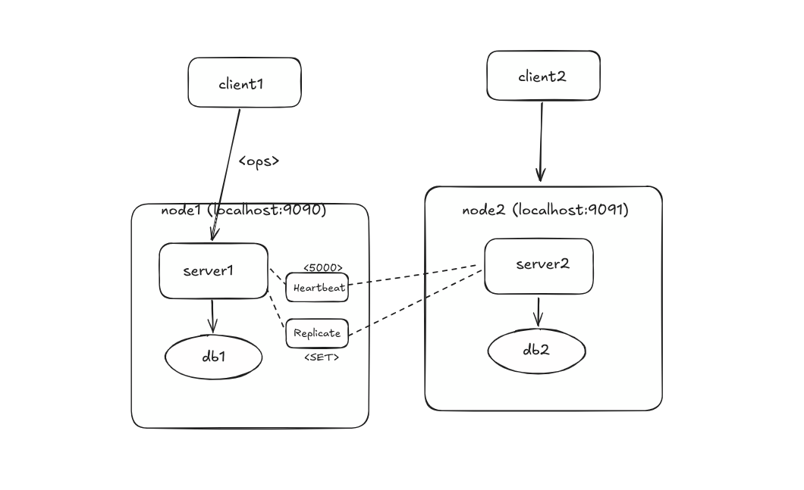

# GammaDB – A Distributed In-Memory Key-Value Store



---

## Features


- **Distributed Storage**: Data partitioned across multiple nodes  
- **Replication**: Ensures data redundancy and availability  
- **Heartbeat Protocol**: Detects node failures and maintains cluster health  
- **Multi-Client Support**: Handles concurrent connections efficiently  

---

## 🚀 Getting Started

### 📦 Prerequisites
- Go 1.20+
- Git

### 📥 Installation

```bash
git clone https://github.com/yourusername/gammaDB.git
cd gammDB
go build

# Start a 3-node cluster
./gammaDB -id node1 -cluster -port 9090
./gammaDB -id node2 -cluster -port 9091
./gammaDB -id node3 -cluster -port 9092
```

### API Documentation

#### HTTP API     (to be implemented)
GET    /v1/key/{key}        # Get value  
POST   /v1/key/{key}        # Set value (body: {"value": "..."})  
DELETE /v1/key/{key}        # Delete key

#### TCP Protocol
SET <key> <value>           # Set key-value pair  
GET <key>                   # Get value  
DELETE <key>                   # Delete key


### Development Roadmap
- Core key-value storage - done
- TCP/HTTP interfaces - done
- Multi-client connection - done
- Multi-node connection - done
- Replication - done
- Raft consensus protocol (WIP)
- Data sharding
- TLS encryption
- Prometheus metrics